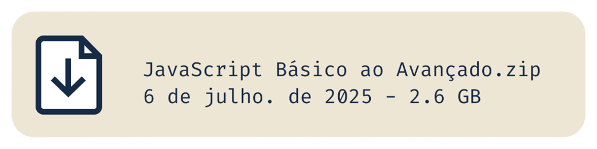

# JavaScript Básico ao Avançado
> Curso feito por: @felipefontoura and Samurai Dev

Um curso de **JavaScript** Básico ao Avançado.

# Download

## O que você vai aprender em cada "**Temporada**"

### [T02](Temporadas/T02/)
Você vai aprender como é que funciona o **JavaScript**, oque é um escopo e sobre como utilizar os comentários.

### [T03](Temporadas/T03/)
Aqui é um começo de uma caminhada do básico, você irá aprender:
* ``typeof`` (indêntificador de tipos)
* Formas de declarar uma ``String``
* Casas decimais
* ``Boolean`` (Verdadeiro ou Falso)
* ``Infinity`` (Infinito)
* ``NaN`` (Not A Number)
* ``Null`` e ``Undefined``
* ``Object`` (Objeto)
* ``Array``
* Datas e Horários (``Date``)

### [T04](Temporadas/T04/)
Aqui vai ser aonde irá aprender mais sobre, variáveis e seus escopos e Case Sensitive

### [T05](Temporadas/T05/)
Você irá aprender muuito mais sobre variáveis e um pouco de ``Object``, ``Array`` e ``Date``:
* Declaration Assigment
* Declaração de multíplas variáveis
* Contacatenação e Interpolação
* Como mudar o valor de um ``Object``
* Como mudar os valores dentro de uma ``Array``
* Formato ISOS no ``Date``

### [T06](Temporadas/T06/)
Aqui vamos aprender sobre operações matemáticas e a ``shorthands`` das variáveis e sobre **Operadores Lógicos**.

* Operadores Aritméticos e Ordem de Precedência
* Atribuição (``shorthand``)
* Mais sobre Atribuições e suas ``shorthands``
* Operador de Igualdade (``==``) e o Operador Idêntico (``===``)
* Como usar o operador de igualdade e o operador idêntico
* Truthy e Falsy
* Operadores Lógicos (``||``, ``&&`` e ``!``)

### [T07](Temporadas/T07/)
Nesta temporada você irá deixar seus programas um pouco mais inteligentes, com:

* ``IF`` (SE)
* ``ELSE`` (SE NÃO)
* ``IF`` composto com ``ELSE IF``
* ``Ternário`` (variável = (condição) ? IF : ELSE)
* ``Switch``
* ``IF`` dos Erros (``Try Catch``)

### [T08](Temporadas/T08/)
Vamos aprender mais sobre estruturas de repetição.

* ``While`` (Primeira Estrutura de Repetição)
* ``For``
* ``For of``
* ``For in``

### [T09](Temporadas/T09/)
Aprenda sobre funções nesta Temporada.
* Como declarar e usar uma ``function``
* Usando parâmetros na ``function``
* Colocando multíplos parâmetros com ``arguments``
* Diferença entre ``comportamento padrão`` e ``comportamento de referência``
* Dúvidas sobre usar a ``function`` antes ou depois da chamada
* ``Arrow function``
* ``Callbacks``

### [T10](Temporadas/T10/)
Aqui você irá aprender sobre conversões de tipos.
* ``Type Casting`` e ``Type Coersion``
* Conversão de ``String`` pra ``Number`` e vice-versa
* Conversão com ``Boolean``, ``String`` e ``Number``
* Conversão de ``Date`` para ``Formato ISO``
* ``Split()`` e ``Join()``
* Formato do Dinheiro com ``Intl``
* Dígitos (valores)
* Quebra e junção de frases
* ``Uppercase`` e ``Lowercase``
* Localizar Carácteres específicos com ``includes``
* Trocar Carácteres com ``replace``
* Conversão de ``JSON``

### [T11](Temporadas/T11/)
Você irá aprender aqui:
* Como modificar uma ``Array`` de forma eficiente
* Concatenação entre elementos como, ``Àrray``, ``Object``, etc
* Desestruturação

### [T12](Temporadas/T12/)
Aqui você começa a avançar muuito para o **Avançado de JavaScript**. Todos os assuntos não alteram os elementos originais!
* ``Filter``
* ``Map``
* ``Reduce`` (``Filter`` + ``Map``)